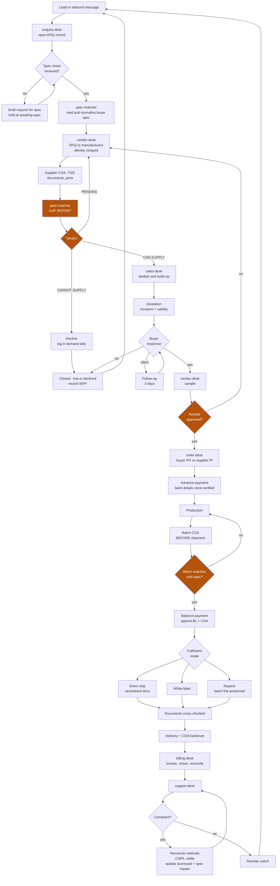
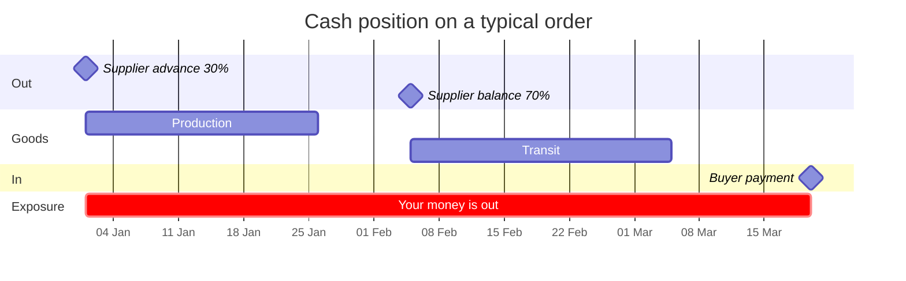

# Trading Flow

How an enquiry becomes money. One loop, eight desks, three gates.

Desk detail: [[Notes/Business/Trading/README]]

---

## The flow

---

## The three gates

Everything else is admin. These three are where money is won or lost.

**1. Spec match: `CAN SUPPLY` or nothing.** No price leaves the business before a
gap report with zero `FAIL` and zero `MISSING`, or a written buyer acceptance of
each deviation. `MISSING` is never `PASS`.

**2. Sample approved.** First order with any supplier, first order to any buyer.
No exception for a good price or an urgent buyer.

**3. Batch COA before shipment.** Matched against the spec recorded in the order
file. A failing batch is a problem in the factory and a disaster on the water.

---

## Money timeline

Where the exposure sits, and why the finance cost line exists in every quote.

Roughly eleven weeks of exposure on a normal order. That is the number the finance
cost line prices, and it is why first orders stay small enough that a total loss
is survivable.

---

## Daily rhythm

| When | Do |
|---|---|
| Morning | New enquiries answered or acknowledged. Nothing sits a full day unanswered |
| Midday | Open orders - anything due today: payment, production date, shipment |
| Evening | Register updated, next actions dated, Daily Note written |
| Monday | Pipeline review. Quotes silent 3+ days get a one-line follow-up |
| Friday | Supplier scorecard, price history, certificate expiry check |

---

## Automation: scheduled tasks

Create with `mcp__scheduled-tasks__create_scheduled_task`. Cron runs in UTC, so
IST times are converted by subtracting 5:30, per the `scheduled-tasks-syntax` rule.

| Task | IST | Cron (UTC) | Does |
|---|---|---|---|
| `trade-enquiry-sweep` | 09:00 daily | `30 3 * * *` | Scan Gmail for new enquiries, open ENQ records, list what needs a reply today |
| `trade-order-check` | 18:30 daily | `0 13 * * *` | Open orders: payment milestones, production dates, shipments due, ETAs to pass on |
| `trade-pipeline-review` | Mon 10:00 | `30 4 * * 1` | Quotes silent 3+ working days, draft one-line follow-ups |
| `trade-vendor-refresh` | Fri 17:00 | `30 11 * * 5` | Supplier scorecard, price history, certificate expiry watch |

Every prompt must be self-contained. A scheduled task runs with no conversation
history. State the vault paths and the desk to use.

**All output is drafts and lists.** Nothing sends, nothing is ordered, nothing is
paid without you.

Set them up when there is real traffic. A sweep over an empty inbox is noise, and
noise you learn to ignore is worse than no alert.

---

## Later, deliberately not now

- **n8n** for always-on inbox watching and webhook-driven enquiry capture, so
  enquiries land without a Claude session open
- A supplier portal for document collection
- Automated freight rate lookups
- A live pipeline dashboard

Each is a real upgrade. Each is worth nothing until the loop above has run for
real, once, end to end.

Links: [[Notes/Business/Trading/README]] · [[Vault Index]] · [[CLAUDE.md]]
